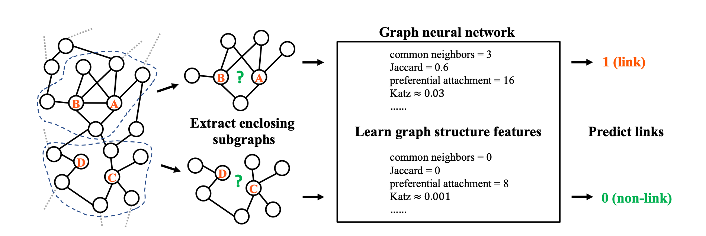

# LINK-PREDICTION-IN-LARGE-SCALE-NETWORK-MxNet-R

This repo contains an MXNet implementation of [paper 1](https://www.cse.wustl.edu/~muhan/papers/KDD_2017.pdf) and [paper 2](https://arxiv.org/pdf/1802.09691.pdf) state of the art link prediction in network with R.


## Requirements
All examples use MxNet 0.10.1 library to perform deep learning, 
and use igraph 1.2.2 to store graph regarding data. To install the library, please type following commands in R Studio
  
```
install.package("mxnet") 
install.package("igraph")
```

## Running the code
Download & extract the training data:

Currently the examples in this directory are tested on the CORA dataset. The GraphSAGE model assumes that node
features are available.

The dataset can be found in example_data folder, and data are in CSV format

The following is the description of the dataset:
> The Cora dataset consists of 2708 scientific publications classified into one of seven classes.
> The citation network consists of 5429 links. Each publication in the dataset is described by a
> 0/1-valued word vector indicating the absence/presence of the corresponding word from the dictionary.
> The dictionary consists of 1433 unique words. The README file in the dataset provides more details.
## Results & Comparison
- Please run `main.R`
- This MXNet implementation achieves *NLL = 0.780* after 100 epochs on the validation dataset
